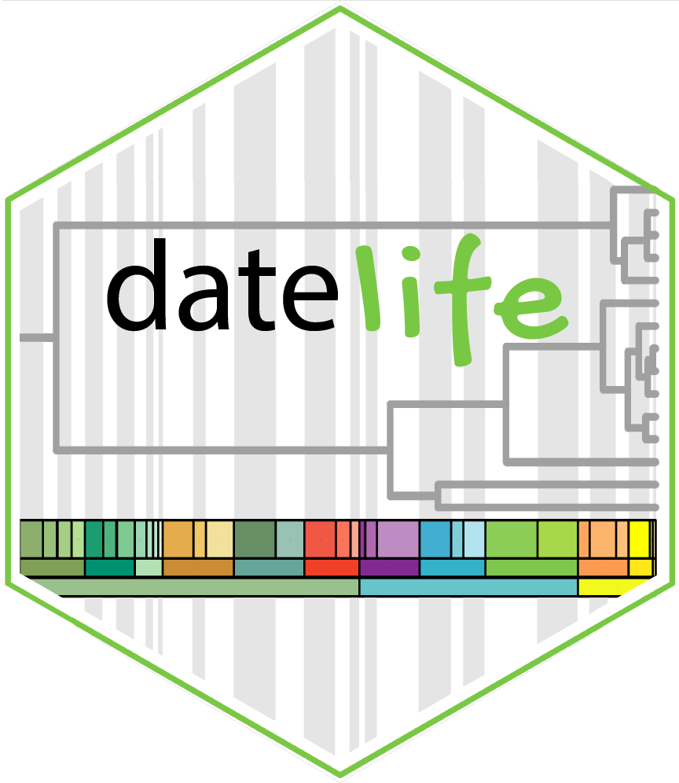

<!-- README.md is generated from README.Rmd. Please edit THIS file -->



<!-- badges: start -->

<!-- [](https://github.com/phylotastic/datelife/actions) -->


[](https://app.codecov.io/gh/phylotastic/datelife)
[](https://github.com/phylotastic/datelife/issues)
[](https://github.com/phylotastic/datelife/issues?q=is%3Aissue+is%3Aclosed)
[](https://zenodo.org/badge/latestdoi/23036/phylotastic/datelife)
[](https://nsf.gov/awardsearch/showAward?AWD_ID=1458603)
[](https://nsf.gov/awardsearch/showAward?AWD_ID=0905606)
[](https://nsf.gov/awardsearch/showAward?AWD_ID=1458572)
[](https://github.com/phylotastic/datelife/actions)
<!-- badges: end -->

# Welcome to DateLife’s R package GitHub repository\!

Get a phylogenetic tree with branch lengths proportional to geologic
time (aka a ***chronogram***) of any two or more lineages of interest to
you.

Use the `datelife` R package locally, or through [DateLife’s
website](http://datelife.opentreeoflife.org/query/) to search for
chronograms available for your lineages of interest in [Open Tree of
Life’s tree store](https://tree.opentreeoflife.org/curator).

You can also date a phylogenetic tree of your own making (or choosing
one from the literature), using node ages from chronograms found with
`datelife` as secondary calibrations.

`datelife` has been developed as part of the
[phylotastic](http://phylotastic.org/) (NSF-funded) project, and is
still under development.

1.  [Installation](#installation)
2.  [Citation](#citation)
3.  [Feedback and info for developers](#feedback)
4.  [License](#license)

## 1\. Installation

Once accepted on CRAN, `datelife`s stable version will be available for
installation with:

``` r
install.packages("datelife")
```

For now, you can install the development version from the GitHub
repository:

``` r
devtools::install_github("phylotastic/datelife")
```

## 2\. Citation

If you use `datelife` for a publication, please cite the R package and
the accompanying paper:

<p>

O’Meara B, Sanchez-Reyes L, Eastman J, Heath T, Wright A, Schliep K,
Chamberlain S, Midford P, Harmon L, Brown J, Pennell M, Alfaro M (2022).
<em>datelife: Go from a List of Taxa or a Tree to a Chronogram using
Open Scientific Data on Time of Lineage Divergence</em>. R package
version 0.5.0.

</p>

<p>

Sanchez-Reyes L, O’Meara B (2019). “datelife: Leveraging databases and
analytical tools to reveal the dated Tree of Life.” <em>bioRxiv</em>,
<b>782094</b>. doi:
<a href="https://doi.org/10.1101/782094">10.1101/782094</a>.

</p>

You can get these citations and the bibtex entry with:

``` r
citation("datelife")
toBibtex(citation("datelife"))
```

.bibtex files are available

## 3\. Feedback and Information for Developers

We welcome and encourage to post a [GitHub
issue](https://github.com/phylotastic/datelife/issues/new) with any
comments, ideas and questions about `datelife`’s software and website.
If you want to contribute with code directly, we welcome and encourage
[pull requests](https://github.com/phylotastic/datelife/pulls).

#### Function documentation:

Package and function documentation was generated with
[roxygen2](https://CRAN.R-project.org/package=roxygen2):

``` r
roxygen2::roxygenise()
```

#### Styling code:

We used the package [lintr](https://CRAN.R-project.org/package=lintr) to
check for coding style:

``` r
lintr::lint_package()
```

#### Calculating test coverage:

Code coverage was calculated with the package
[covr](https://CRAN.R-project.org/package=covr):

``` r
cov <- covr::package_coverage()

usethis::use_data(cov, overwrite = TRUE)
```

You can see an interactive report of testing coverage:

``` r
covr::report(cov)
```

And, find code with zero coverage:

``` r
covr::zero_coverage(cov)
```

#### Generating `datelife`’s hexsticker:

Code used to generate current `datelife`’s logo hexsticker is in
[data-raw/hexsticker-current.R](https://github.com/phylotastic/datelife/blob/master/data-raw/hexsticker-current.R)

#### Rendering the vignettes:

Vignettes are rendered automatically upon built. However, if you wish to
see how they look rendered before releasing the package, you can do this
with `knitr::knit()`. The following command renders the vignette
`Getting_started_with_datelife` as html:

``` r
knitr::knit("vignettes/Getting_started_with_datelife.Rmd")
```

#### Creating a webiste for the package

Using `pkgdown` for this is quite straightforward and fun:

``` r
usethis::use_pkgdown()
pkgdown::build_site()
```

#### Releasing to CRAN

##### Local checks

To be able to release to CRAN, the first step is to pass the checks
locally. To run a local check, you can use the command `R CMD check`
from your terminal. For that, change directories to the one above your
working clone of the `datelife` repo:

``` bash
cd ../
```

Generate a tar ball for your package by running `R CMD build
package-name`:

``` bash
R CMD build datelife
```

Finally, run `R CMD check package-tar-ball` on the tar ball that you
just generated:

``` bash
R CMD check datelife_0.6.0.tar.gz
```

##### Remote checks

If you do not have access to different OS to test your package on, the
[rhub](https://CRAN.R-project.org/package=rhub) package allows remote
testing on a variety of OS with the command:

``` r
rhub::check_for_cran()
```

To submit to CRAN call `devtools::release()` and answer the prompted
questions. If the answer to all of these is *yes*, the package will be
submitted to CRAN :rocket:

## 4\. License

This package is free and open source software, licensed under GPL.
