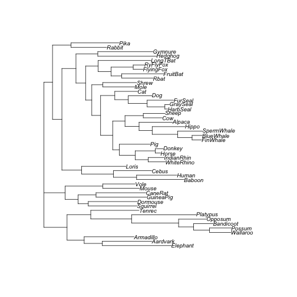
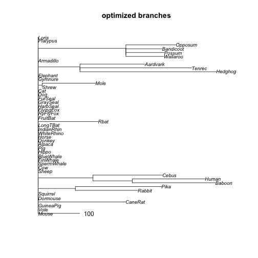

```r
library(datelife)
library(phangorn)
```

Ideally, to perform a phylogenetic dating analysis, we require some estimate of initial branch lengths.

`datelife` does this by extracting DNA sequence data from BOLD.

The function `make_bold_otol_tree()` does all the work:


```r
make_bold_otol_tree(input = "Canis")
```

To exemplify how the function works under the hood, we will use a DNA sequence alignment data set provided in the `phangorn` package:


```r
data(Laurasiatherian)
Laurasiatherian
#> 47 sequences with 3179 character and 1605 different site patterns.
#> The states are a c g t
common_names <- names(Laurasiatherian)
common_names
#>  [1] "Platypus"   "Wallaroo"   "Possum"     "Bandicoot"  "Opposum"   
#>  [6] "Armadillo"  "Elephant"   "Aardvark"   "Tenrec"     "Hedghog"   
#> [11] "Gymnure"    "Mole"       "Shrew"      "Rbat"       "FlyingFox" 
#> [16] "RyFlyFox"   "FruitBat"   "LongTBat"   "Horse"      "Donkey"    
#> [21] "WhiteRhino" "IndianRhin" "Pig"        "Alpaca"     "Cow"       
#> [26] "Sheep"      "Hippo"      "FinWhale"   "BlueWhale"  "SpermWhale"
#> [31] "Rabbit"     "Pika"       "Squirrel"   "Dormouse"   "GuineaPig" 
#> [36] "Mouse"      "Vole"       "CaneRat"    "Baboon"     "Human"     
#> [41] "Loris"      "Cebus"      "Cat"        "Dog"        "HarbSeal"  
#> [46] "FurSeal"    "GraySeal"
```

Get scientific names from common names:


```r
taxize_names <- taxize::comm2sci(common_names)
```


```r
length(taxize_names)
#> [1] 47

is_empty <- lapply(taxize_names, length) == 0

taxize_names[is_empty] <- "NA"

taxon_names <- unlist(taxize_names)
names(taxon_names[is_empty])
#>  [1] "Wallaroo"   "Possum"     "Bandicoot"  "Opposum"    "Elephant"  
#>  [6] "Aardvark"   "Tenrec"     "Hedghog"    "Gymnure"    "Mole"      
#> [11] "Shrew"      "Rbat"       "FlyingFox"  "RyFlyFox"   "FruitBat"  
#> [16] "LongTBat"   "WhiteRhino" "IndianRhin" "Hippo"      "FinWhale"  
#> [21] "BlueWhale"  "SpermWhale" "Pika"       "Squirrel"   "Dormouse"  
#> [26] "GuineaPig"  "Vole"       "CaneRat"    "Loris"      "Cebus"     
#> [31] "HarbSeal"   "FurSeal"    "GraySeal"
```

Manually add scientific names that were not found with `taxize`:


```r
# rphylotastic::taxa_common_to_scientific(common_names)
taxon_names["Wallaroo"] <- "Macropus robustus"
taxon_names["Possum"] <- "Trichosurus"
taxon_names["Bandicoot"] <- "Perameles"
taxon_names["Opposum"] <- "Didelphis marsupialis"
taxon_names["Elephant"] <- "Elephas maximus"
taxon_names["Aardvark"] <- "Orycteropus afer"
taxon_names["Tenrec"] <- "Hemicentetes"
taxon_names["Hedghog"] <- "Echinops"
taxon_names["Gymnure"] <- "Echinosorex gymnura"
taxon_names["Mole"] <- "Talpa"
taxon_names["Shrew"] <- "Sorex"
taxon_names["Rbat"] <- "Lasiurus borealis"
taxon_names["FlyingFox"] <- "Pteropus alecto"
taxon_names["RyFlyFox"] <- "Pteropus aruensis"
taxon_names["FruitBat"] <- "Desmodus rotundus"
taxon_names["LongTBat"] <- "Chalinolobus tuberculatus"
taxon_names["WhiteRhino"] <- "Ceratotherium simum"
taxon_names["IndianRhin"] <- "Rhinoceros unicornis"
taxon_names["Hippo"] <- "Hippopotamus amphibius"
taxon_names["FinWhale"] <- "Balaenoptera physalus"
taxon_names["BlueWhale"] <- "Balaenoptera musculus"
taxon_names["SpermWhale"] <- "Physeter macrocephalus"
taxon_names["Pika"] <- "Ochotona"
taxon_names["Squirrel"] <- "Sciurini"
taxon_names["Dormouse"] <- "Gliridae"
taxon_names["GuineaPig"] <- "Cavia porcellus"
taxon_names["Vole"] <- "Arvicolinae"
taxon_names["CaneRat"] <- "Thryonomys"
taxon_names["Loris"] <- "Lorisinae"
taxon_names["Cebus"] <- "Cebus"
taxon_names["HarbSeal"] <- "Phoca vitulina"
taxon_names["FurSeal"] <- "Otariidae"
taxon_names["GraySeal"] <- "Halichoerus grypus"
```

Get datelife query data:


```r
query <- datelife::make_datelife_query2(input = taxon_names)
#> ---> Phylo-processing 'input'.
#> * 'input' is not a phylogeny.
#> ---> Runnning TNRS to match to reference taxonomy ott.
#>                                                                    
  |================================================================| 100%
```


```r
data.frame(query$cleaned_names, query$tnrs_names)
#>          query.cleaned_names                 query.tnrs_names
#> 1   Ornithorhynchus anatinus         Ornithorhynchus anatinus
#> 2          Macropus robustus              Osphranter robustus
#> 3                Trichosurus                      Trichosurus
#> 4                  Perameles                        Perameles
#> 5      Didelphis marsupialis            Didelphis marsupialis
#> 6                Dasypodidae                      Dasypodidae
#> 7            Elephas maximus                  Elephas maximus
#> 8           Orycteropus afer                 Orycteropus afer
#> 9               Hemicentetes                     Hemicentetes
#> 10                  Echinops Echinops (genus in Opisthokonta)
#> 11       Echinosorex gymnura              Echinosorex gymnura
#> 12                     Talpa                            Talpa
#> 13                     Sorex                            Sorex
#> 14         Lasiurus borealis                Lasiurus borealis
#> 15           Pteropus alecto                  Pteropus alecto
#> 16         Pteropus aruensis                Pteropus aruensis
#> 17         Desmodus rotundus                Desmodus rotundus
#> 18 Chalinolobus tuberculatus        Chalinolobus tuberculatus
#> 19            Equus caballus                   Equus caballus
#> 20              Equus asinus                     Equus asinus
#> 21       Ceratotherium simum              Ceratotherium simum
#> 22      Rhinoceros unicornis             Rhinoceros unicornis
#> 23                Sus scrofa                       Sus scrofa
#> 24             Vicugna pacos                    Vicugna pacos
#> 25                Bos taurus                       Bos taurus
#> 26                Ovis aries                       Ovis aries
#> 27    Hippopotamus amphibius           Hippopotamus amphibius
#> 28     Balaenoptera physalus            Balaenoptera physalus
#> 29     Balaenoptera musculus            Balaenoptera musculus
#> 30    Physeter macrocephalus                 Physeter catodon
#> 31     Oryctolagus cuniculus            Oryctolagus cuniculus
#> 32                  Ochotona                         Ochotona
#> 33                  Sciurini                         Sciurini
#> 34                  Gliridae                         Gliridae
#> 35           Cavia porcellus                  Cavia porcellus
#> 36              Mus musculus                     Mus musculus
#> 37               Arvicolinae                      Arvicolinae
#> 38                Thryonomys                       Thryonomys
#> 39               Papio papio                      Papio papio
#> 40              Homo sapiens                     Homo sapiens
#> 41                 Lorisinae                        Corixinae
#> 42                     Cebus                            Cebus
#> 43               Felis catus                      Felis catus
#> 44    Canis lupus familiaris           Canis lupus familiaris
#> 45            Phoca vitulina                   Phoca vitulina
#> 46                 Otariidae                        Otariidae
#> 47        Halichoerus grypus               Halichoerus grypus
```

Get a topology:


```r
topology <- rotl::tol_induced_subtree(ott_ids = query$ott_ids, label_format = "id") 
#> 
Progress [---------------------------------] 0/350 (  0) ?s
Progress [==============================] 350/350 (100)  0s
                                                            
topology_names <- rotl::tol_induced_subtree(ott_ids = query$ott_ids, label_format = "name")$tip.label
#> 
Progress [---------------------------------] 0/350 (  0) ?s
Progress [==============================] 350/350 (100)  0s
                                                            
topology <- ape::collapse.singles(topology)
index <- match(topology$tip.label, paste0("ott", query$ott_ids))
data.frame(topology$tip.label, query$ott_ids[index])
#>    topology.tip.label query.ott_ids.index.
#> 1           ott542509               542509
#> 2           ott664070               664070
#> 3           ott744000               744000
#> 4           ott692681               692681
#> 5           ott649553               649553
#> 6           ott425409               425409
#> 7           ott864596               864596
#> 8           ott644237               644237
#> 9           ott513904               513904
#> 10          ott770315               770315
#> 11          ott217260               217260
#> 12           ott70819                70819
#> 13          ott490099               490099
#> 14          ott276851               276851
#> 15          ott226193               226193
#> 16          ott226190               226190
#> 17          ott510762               510762
#> 18          ott730013               730013
#> 19          ott906301               906301
#> 20         ott1068202              1068202
#> 21         ott1068218              1068218
#> 22         ott1034198              1034198
#> 23         ott1087496              1087496
#> 24          ott970126               970126
#> 25           ott61860                61860
#> 26          ott238431               238431
#> 27          ott813028               813028
#> 28         ott3613485              3613485
#> 29          ott698422               698422
#> 30         ott1040694              1040694
#> 31          ott749638               749638
#> 32          ott247333               247333
#> 33          ott563166               563166
#> 34          ott226394               226394
#> 35          ott222367               222367
#> 36         ott1027567              1027567
#> 37          ott541928               541928
#> 38          ott222356               222356
#> 39          ott542053               542053
#> 40          ott561087               561087
#> 41          ott273244               273244
#> 42          ott372367               372367
#> 43          ott323243               323243
#> 44          ott683256               683256
#> 45          ott919176               919176
#> 46          ott962377               962377
#> 47          ott571895               571895
a <- query$cleaned_names %in% query$cleaned_names[index]
query$cleaned_names[!a]
#> character(0)

data.frame(query$cleaned_names[index], taxon_names[index])
#>            query.cleaned_names.index.        taxon_names.index.
#> Mouse                    Mus musculus              Mus musculus
#> Vole                      Arvicolinae               Arvicolinae
#> GuineaPig             Cavia porcellus           Cavia porcellus
#> CaneRat                    Thryonomys                Thryonomys
#> Squirrel                     Sciurini                  Sciurini
#> Dormouse                     Gliridae                  Gliridae
#> Rabbit          Oryctolagus cuniculus     Oryctolagus cuniculus
#> Pika                         Ochotona                  Ochotona
#> Baboon                    Papio papio               Papio papio
#> Human                    Homo sapiens              Homo sapiens
#> Cebus                           Cebus                     Cebus
#> Sheep                      Ovis aries                Ovis aries
#> Cow                        Bos taurus                Bos taurus
#> SpermWhale     Physeter macrocephalus    Physeter macrocephalus
#> FinWhale        Balaenoptera physalus     Balaenoptera physalus
#> BlueWhale       Balaenoptera musculus     Balaenoptera musculus
#> Hippo          Hippopotamus amphibius    Hippopotamus amphibius
#> Pig                        Sus scrofa                Sus scrofa
#> Alpaca                  Vicugna pacos             Vicugna pacos
#> Donkey                   Equus asinus              Equus asinus
#> Horse                  Equus caballus            Equus caballus
#> WhiteRhino        Ceratotherium simum       Ceratotherium simum
#> IndianRhin       Rhinoceros unicornis      Rhinoceros unicornis
#> LongTBat    Chalinolobus tuberculatus Chalinolobus tuberculatus
#> Rbat                Lasiurus borealis         Lasiurus borealis
#> FruitBat            Desmodus rotundus         Desmodus rotundus
#> FlyingFox             Pteropus alecto           Pteropus alecto
#> RyFlyFox            Pteropus aruensis         Pteropus aruensis
#> HarbSeal               Phoca vitulina            Phoca vitulina
#> GraySeal           Halichoerus grypus        Halichoerus grypus
#> FurSeal                     Otariidae                 Otariidae
#> Dog            Canis lupus familiaris    Canis lupus familiaris
#> Cat                       Felis catus               Felis catus
#> Shrew                           Sorex                     Sorex
#> Mole                            Talpa                     Talpa
#> Gymnure           Echinosorex gymnura       Echinosorex gymnura
#> Elephant              Elephas maximus           Elephas maximus
#> Hedghog                      Echinops                  Echinops
#> Tenrec                   Hemicentetes              Hemicentetes
#> Aardvark             Orycteropus afer          Orycteropus afer
#> Armadillo                 Dasypodidae               Dasypodidae
#> Wallaroo            Macropus robustus         Macropus robustus
#> Possum                    Trichosurus               Trichosurus
#> Bandicoot                   Perameles                 Perameles
#> Opposum         Didelphis marsupialis     Didelphis marsupialis
#> Platypus     Ornithorhynchus anatinus  Ornithorhynchus anatinus
#> Loris                       Lorisinae                 Lorisinae
topology$tip.label <- names(taxon_names[index])
```

Get an NJ tree:


```r
# get NJ tree
dm <- dist.hamming(Laurasiatherian)
tree_nj <- NJ(dm)
# parsimony(tree_nj, Laurasiatherian)
plot(tree_nj)
```


---

Get branch lengths with ACCTRAN algorithm (deltran is not available in R):


```r
# names(Laurasiatherian)
tree_acctran <- phangorn::acctran(tree = tree_nj, 
                                  data = Laurasiatherian)
plot(tree_acctran, cex = 0.8)
```




Optimize branch lengths to get maximum likelihood:


```r
pml <- phangorn::pml(tree_acctran, data = Laurasiatherian)
tree_pml <- phangorn::optim.pml(pml, data = Laurasiatherian)
#> optimize edge weights:  -207130.4 --> -92073.04 
#> optimize edge weights:  -92073.04 --> -60586.86 
#> optimize edge weights:  -60586.86 --> -54303.67 
#> optimize edge weights:  -54303.67 --> -54303.67
plot(tree_pml, cex = 0.8)
```


```r
data.frame(nj = ape::branching.times(tree_nj), 
           acctran = ape::branching.times(tree_acctran), 
           optim_pml = ape::branching.times(tree_pml$tree))
#>             nj acctran    optim_pml
#> 48 0.075159106   321.0  0.107064350
#> 49 0.074663666   284.0  0.102593327
#> 50 0.073681576   244.0  0.097146781
#> 51 0.072808761   230.0  0.092561163
#> 52 0.071237434   160.0  0.080246326
#> 53 0.070852888   184.0  0.085875992
#> 54 0.072402082   222.0  0.094843463
#> 55 0.070159654   175.0  0.086331259
#> 56 0.070158809   149.0  0.079683763
#> 57 0.068402201    71.5  0.061969166
#> 58 0.066330555   143.0  0.074316747
#> 59 0.066063222   116.5  0.072728795
#> 60 0.063112914    79.0  0.062921450
#> 61 0.062316865    89.5  0.058590132
#> 62 0.060984052    27.5  0.053168778
#> 63 0.059516822    -1.0  0.049363834
#> 64 0.060010969    70.0  0.060093467
#> 65 0.058745717    34.5  0.052868434
#> 66 0.068287715   121.0  0.079088325
#> 67 0.067707842   131.5  0.070542031
#> 68 0.057316264   -25.0  0.038478291
#> 69 0.055307172   -85.0  0.029719556
#> 70 0.055854838   -11.0  0.041133191
#> 71 0.053485916  -141.0  0.021404320
#> 72 0.061528553    91.0  0.054118927
#> 73 0.054099932    18.5  0.045794155
#> 74 0.052307954   -68.5  0.035347826
#> 75 0.052921072   -39.0  0.034727448
#> 76 0.062130184   205.0  0.072165304
#> 77 0.061680356    98.5  0.056499524
#> 78 0.053837166    24.0  0.045532404
#> 79 0.038484053  -124.0  0.015848828
#> 80 0.039374093  -119.5  0.013503246
#> 81 0.036273689  -103.0  0.008657362
#> 82 0.034213936  -249.5 -0.009260506
#> 83 0.047525047   -53.0  0.034485225
#> 84 0.042017855   -74.5  0.020045102
#> 85 0.024609363  -154.0  0.005832687
#> 86 0.025461698   -60.0  0.011005829
#> 87 0.037238301    70.0  0.030054865
#> 88 0.016952218  -311.0 -0.027997263
#> 89 0.016785633  -195.0 -0.010363564
#> 90 0.011732705  -253.5 -0.017033589
#> 91 0.009098229  -317.5 -0.028687772
#> 92 0.001053604  -385.5 -0.048094863
```

## Using OpenTree topology:


```r
# ape::comparePhylo(x = tree_nj, y = tree_acctran)

otol_acctran <- phangorn::acctran(tree = ape::unroot(topology), 
                                  data = Laurasiatherian)

# get likelihood of acctran branch lengths and alignment
otol_pml <- phangorn::pml(otol_acctran, data = Laurasiatherian)
# optimize branch lengths
otol_optim <-  phangorn::optim.pml(otol_pml)
#> optimize edge weights:  -207130.4 --> -106097.5 
#> optimize edge weights:  -106097.5 --> -106096.6 
#> optimize edge weights:  -106096.6 --> -106096.6

data.frame(otol_acctran = ape::branching.times(otol_acctran), 
           otol_optim_pml = ape::branching.times(otol_optim$tree))
#>                        otol_acctran otol_optim_pml
#> ott244265                     136.0   8.100226e-02
#> ott229558                     -48.0   6.705178e-02
#> ott683263                    -163.0   6.705177e-02
#> ott5334778                   -205.0   6.345339e-02
#> ott392222                    -264.5   4.802316e-02
#> mrcaott42ott29157            -317.5   4.802315e-02
#> mrcaott42ott10477            -363.0   4.802313e-02
#> mrcaott42ott38834            -426.5   3.757718e-02
#> mrcaott102ott739             -565.0  -1.873340e-02
#> mrcaott38834ott45520         -510.0  -5.291179e-02
#> ott44559                     -412.5   3.042209e-02
#> ott644242                    -407.0  -8.945198e+01
#> ott386195                    -396.5  -1.319520e+02
#> mrcaott786ott83926           -491.0  -2.264520e+02
#> ott392223                    -250.5   4.934326e-02
#> mrcaott1548ott4697           -290.0   3.508578e-02
#> mrcaott1548ott6790           -325.0   2.671321e-02
#> mrcaott1548ott3021           -353.0   1.838742e-02
#> ott622916                    -411.0   5.608031e-03
#> mrcaott1548ott21987          -457.0  -1.454455e-03
#> mrcaott1548ott5256           -511.0  -1.051769e-02
#> ott768677                    -589.0  -4.083177e-02
#> ott7655791                   -556.0  -2.006278e-02
#> mrcaott5256ott44568          -658.0  -5.017645e-02
#> mrcaott44568ott226190        -721.5  -6.958462e-02
#> ott541948                    -397.0   6.043458e-03
#> ott541951                    -476.5  -2.445224e-02
#> ott1034218                   -458.5  -1.304954e-02
#> ott574724                    -386.0   1.230833e-02
#> mrcaott6790ott6794           -462.5  -6.137077e-03
#> mrcaott10323ott61857         -508.0  -8.318380e-02
#> ott813030                    -488.5  -2.606782e-02
#> mrcaott4697ott6940           -349.0   2.214181e-02
#> ott827263                    -408.0   1.153504e-02
#> mrcaott22064ott95364         -486.0  -1.026178e-02
#> mrcaott22064ott6145546       -561.5  -3.342281e-02
#> mrcaott3285ott17250          -321.0  -5.802449e-02
#> mrcaott3285ott60434          -359.0  -1.005802e+01
#> mrcaott72667ott180375        -239.0   4.144542e-02
#> ott746703                    -318.0  -2.134463e-03
#> mrcaott82081ott292026        -418.5  -1.005021e+02
#> ott922729                    -508.5  -1.005021e+02
#> mrcaott6735ott29033          -259.0  -2.109329e+02
#> mrcaott6735ott70811          -321.0  -2.109329e+02
#> mrcaott6735ott44497          -385.0  -2.109329e+02
```


```r
plot(otol_pml, main="ACCTRAN branches", cex = 0.8)   # top = default 
```


```r
plot(otol_optim, main="optimized branches", cex = 0.8)   # bottom = optimized branch lengths
```


